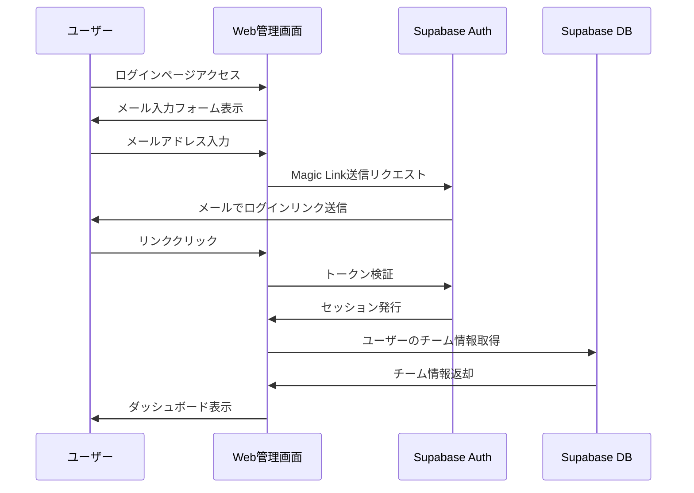

# #013 チーム管理画面（Web）

## 概要

チームプラン向けのWeb管理ダッシュボード。工務店の親方・事務員がPCから全メンバーの日報・請求書を一元管理できる。

## ステータス

🔵 Todo

## 優先度

P2（v2）

## 依存

- #011 チームプラン機能（チームデータモデル）
- #002 データ層（Supabaseスキーマ）

---

## 背景

### 課題

- 5〜50人規模の工務店では、メンバー全員の報告をスマホで個別確認するのは非効率
- 月末の請求書まとめ作業をPC大画面で行いたい
- メンバーの追加・削除・権限管理を一箇所で行いたい

### 解決策

PC向けのWeb管理画面を提供し、チーム全体の管理業務を効率化

---

## 画面一覧

### 1. ダッシュボード

**パス**: `/dashboard`

**機能**:
- 今日の作業状況サマリー（完了/進行中/未着手）
- 直近のアラート（未提出日報、期限切れ請求書）
- メンバー別ステータス一覧
- クイックアクション（招待、レポート出力）

**ワイヤーフレーム**:
```
┌─────────────────────────────────────────────────────┐
│  GENBA GEAR                    [チーム名] [ログアウト]  │
├──────────┬──────────────────────────────────────────┤
│          │  今日の状況                               │
│ ダッシュ  │  ┌────┐ ┌────┐ ┌────┐                    │
│ ボード   │  │完了 │ │進行│ │未着│                    │
│          │  │ 5  │ │ 3  │ │ 2  │                    │
│ メンバー  │  └────┘ └────┘ └────┘                    │
│          │                                          │
│ 日報     │  アラート                                 │
│          │  ⚠️ 田中: 昨日の日報未提出                  │
│ 請求書   │  ⚠️ 鈴木建設: 請求書期限3日後               │
│          │                                          │
│ レポート  │  メンバー状況                             │
│          │  ┌──────────────────────────────────┐    │
│ 設定     │  │ 山田太郎  ✅ 日報提出済  現場: 田中邸    │    │
│          │  │ 佐藤次郎  🔄 作業中    現場: 鈴木ビル   │    │
│          │  │ 田中三郎  ⏳ 未着手                   │    │
│          │  └──────────────────────────────────┘    │
└──────────┴──────────────────────────────────────────┘
```

### 2. メンバー管理

**パス**: `/members`

**機能**:
- メンバー一覧表示（名前、ロール、最終ログイン）
- 招待コード/リンク発行
- ロール変更（オーナーのみ）
- メンバー削除（オーナーのみ）

**ワイヤーフレーム**:
```
┌─────────────────────────────────────────────────────┐
│  メンバー管理                    [+ メンバー招待]      │
├─────────────────────────────────────────────────────┤
│  検索: [____________]  ロール: [全て ▼]              │
├─────────────────────────────────────────────────────┤
│  名前          ロール      最終ログイン    操作       │
│  ─────────────────────────────────────────────────  │
│  山田太郎      オーナー    2025/01/17     -          │
│  佐藤次郎      管理者      2025/01/17     [編集][削除] │
│  田中三郎      メンバー    2025/01/16     [編集][削除] │
│  鈴木四郎      メンバー    2025/01/15     [編集][削除] │
└─────────────────────────────────────────────────────┘
```

**招待モーダル**:
```
┌───────────────────────────────────┐
│  メンバー招待                 [×]  │
├───────────────────────────────────┤
│                                   │
│  招待リンク:                       │
│  ┌─────────────────────────────┐  │
│  │ https://app.genba.../invite │  │
│  │ /abc123                     │  │
│  └─────────────────────────────┘  │
│             [コピー]               │
│                                   │
│  または招待コード: ABC-123-XYZ     │
│                                   │
│  有効期限: 7日間                   │
│  ロール: [メンバー ▼]              │
│                                   │
│         [招待リンク発行]            │
└───────────────────────────────────┘
```

### 3. 日報一覧

**パス**: `/reports`

**機能**:
- 全メンバーの日報一覧
- 日付・メンバー・現場でフィルタリング
- 日報詳細表示
- CSV/PDFエクスポート

**ワイヤーフレーム**:
```
┌─────────────────────────────────────────────────────┐
│  日報一覧                         [CSVエクスポート]   │
├─────────────────────────────────────────────────────┤
│  期間: [2025/01/01] 〜 [2025/01/17]                  │
│  メンバー: [全員 ▼]  現場: [全て ▼]  [検索]           │
├─────────────────────────────────────────────────────┤
│  日付       メンバー    現場        作業内容    状態   │
│  ────────────────────────────────────────────────── │
│  01/17     山田太郎    田中邸      エアコン設置  ✅    │
│  01/17     佐藤次郎    鈴木ビル    配管工事     ✅    │
│  01/16     田中三郎    山本邸      電気配線     ✅    │
│  01/16     山田太郎    田中邸      事前調査     ✅    │
└─────────────────────────────────────────────────────┘
```

### 4. 集約レポート

**パス**: `/analytics`

**機能**:
- 期間別作業集計グラフ
- メンバー別作業時間・件数
- 現場別集計
- PDF出力

**ワイヤーフレーム**:
```
┌─────────────────────────────────────────────────────┐
│  集約レポート            期間: [今月 ▼] [PDF出力]    │
├─────────────────────────────────────────────────────┤
│                                                     │
│  作業件数推移                                        │
│  ┌─────────────────────────────────────────┐       │
│  │     📊 棒グラフ（日別作業件数）            │       │
│  └─────────────────────────────────────────┘       │
│                                                     │
│  メンバー別集計          現場別集計                  │
│  ┌──────────────┐      ┌──────────────┐           │
│  │ 山田: 25件   │      │ 田中邸: 15件 │           │
│  │ 佐藤: 20件   │      │ 鈴木ビル: 12件│           │
│  │ 田中: 18件   │      │ 山本邸: 8件  │           │
│  └──────────────┘      └──────────────┘           │
└─────────────────────────────────────────────────────┘
```

### 5. 請求書管理

**パス**: `/invoices`

**機能**:
- チーム全体の請求書一覧
- ステータス管理（下書き/送付済/入金済）
- 一括PDF出力
- 請求書詳細・編集

### 6. 顧客マスタ

**パス**: `/customers`

**機能**:
- 共有顧客情報の一覧
- 顧客追加・編集・削除
- 顧客別作業履歴表示

### 7. プラン・課金

**パス**: `/billing`（オーナーのみ）

**機能**:
- 現在のプラン表示
- 請求履歴
- 支払い方法変更（Stripe Customer Portal）
- プラン変更・キャンセル

### 8. チーム設定

**パス**: `/settings`（オーナーのみ）

**機能**:
- チーム名変更
- チームロゴアップロード
- 通知設定（日報未提出アラートなど）
- チーム削除

---

## 技術仕様

### フレームワーク

```
React Router v7 + Cloudflare Pages
├── app/
│   ├── routes/
│   │   ├── _index.tsx      # ダッシュボード
│   │   ├── login.tsx
│   │   ├── invite.$code.tsx
│   │   ├── members.tsx
│   │   ├── reports.tsx
│   │   ├── reports.$id.tsx
│   │   ├── analytics.tsx
│   │   ├── invoices.tsx
│   │   ├── invoices.$id.tsx
│   │   ├── customers.tsx
│   │   ├── customers.$id.tsx
│   │   ├── billing.tsx
│   │   └── settings.tsx
│   ├── root.tsx
│   └── entry.server.tsx
├── components/
│   ├── ui/                  # 共通UIコンポーネント
│   ├── dashboard/
│   ├── members/
│   └── reports/
├── lib/
│   ├── supabase.server.ts
│   └── utils/
├── functions/
│   └── [[path]].ts
└── wrangler.toml
```

### 認証フロー



### データ取得

```typescript
// lib/supabase/queries.ts

// チームメンバー一覧
export async function getTeamMembers(teamId: string) {
  const { data, error } = await supabase
    .from('team_members')
    .select(`
      id,
      role,
      user:user_profiles(
        id,
        business_name,
        representative_name
      )
    `)
    .eq('team_id', teamId)
    .order('created_at', { ascending: true });

  return { data, error };
}

// 日報一覧（チーム全体）
export async function getTeamDailyReports(
  teamId: string,
  filters: ReportFilters
) {
  let query = supabase
    .from('daily_reports')
    .select(`
      *,
      user:user_profiles(business_name),
      customer:customers(name)
    `)
    .eq('team_id', teamId);

  if (filters.startDate) {
    query = query.gte('report_date', filters.startDate);
  }
  if (filters.endDate) {
    query = query.lte('report_date', filters.endDate);
  }
  if (filters.memberId) {
    query = query.eq('user_id', filters.memberId);
  }

  return query.order('report_date', { ascending: false });
}
```

### RLSポリシー

```sql
-- team_members: チームメンバーのみ閲覧可能
CREATE POLICY "Team members can view their team"
ON team_members FOR SELECT
USING (
  team_id IN (
    SELECT team_id FROM team_members
    WHERE user_id = auth.uid()
  )
);

-- daily_reports: 同じチームのレポートのみ閲覧可能
CREATE POLICY "Team members can view team reports"
ON daily_reports FOR SELECT
USING (
  team_id IN (
    SELECT team_id FROM team_members
    WHERE user_id = auth.uid()
  )
);

-- チーム設定: オーナーのみ更新可能
CREATE POLICY "Only owner can update team"
ON teams FOR UPDATE
USING (
  owner_id = auth.uid()
);
```

---

## デザイン仕様

### カラーパレット

モバイルアプリと統一（GENBA GEARデザインシステム準拠）

```css
:root {
  /* プライマリ: ティールグリーン */
  --color-primary-900: #0d4f4f;
  --color-primary-700: #147878;
  --color-primary-500: #1a9e9e;

  /* セカンダリ: ダークネイビー */
  --color-secondary-900: #1a1f3d;
  --color-secondary-700: #2d3561;

  /* アクセント: 警告イエロー */
  --color-accent: #f5c518;

  /* ベース */
  --color-background: #f5f5f5;
  --color-surface: #ffffff;
  --color-text: #1a1a1a;
  --color-text-muted: #6b7280;
}
```

### コンポーネント

- ボタン: 高さ40px以上、角丸6px
- カード: 白背景、影`0 2px 8px rgba(0,0,0,0.08)`
- テーブル: ストライプなし、ホバーで背景色変更
- サイドバー: 幅240px、ダークネイビー背景

---

## タスク

### Phase 1: 基盤構築

- [ ] React Router v7 + Cloudflare Pagesプロジェクト初期化
- [ ] Supabase Auth連携
- [ ] 共通レイアウト（サイドバー、ヘッダー）
- [ ] ルーティング設定

### Phase 2: コア画面

- [ ] ログイン画面
- [ ] ダッシュボード
- [ ] メンバー管理（一覧、招待、削除）
- [ ] 日報一覧

### Phase 3: 拡張画面

- [ ] 集約レポート（グラフ）
- [ ] 請求書管理
- [ ] 顧客マスタ
- [ ] プラン・課金（Stripe連携）
- [ ] チーム設定

### Phase 4: 仕上げ

- [ ] レスポンシブ対応（タブレット）
- [ ] エラーハンドリング
- [ ] ローディング状態
- [ ] E2Eテスト

---

## 参考

- [機能一覧](/docs/requirements/features.md)
- [#011 チームプラン機能](/issues/011-team-features.md)
- [デザインシステム](/.claude/skills/genba-design-system/SKILL.md)
